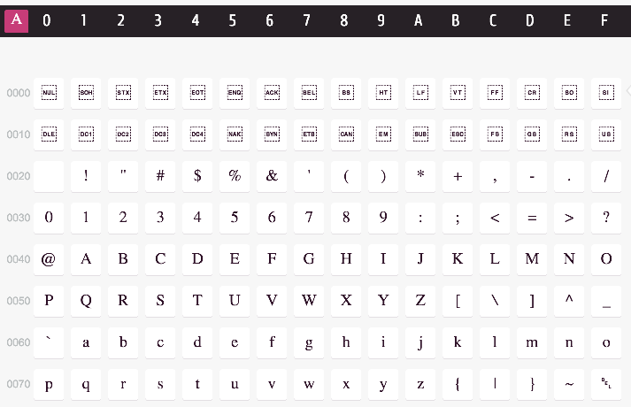

# Unicode

In our previous lesson, we learned how ASCII created the bases for encodings. We also saw how it quickly fell short, as 128 characters were not enough to represent every language out there, which caused a huge list of new encodings to start proliferating. The compatibility issues introduced by the usage of multiple encodings lead into the creation of a "Universal Standard": **say hi to Unicode!** 👋

Unicode is similar to ASCII and to the table we created in our lesson about Understanding Text, but with an important difference. For every symbol or character defined in Unicode, instead of specifying a particular sequence of bits to which the given symbol or character will be translated to, it assigns an abstract _code point_. **Unicode doesn't specify the actual bits in which the characters will be translated**. You can think of Unicode as a step in between of what we used to know as "_encoding_". The previous process (followed by our own table or by ASCII) was to assign a bit representation to every character: **character -> bit representation**. But Unicode will just assign an abstract _code point_, without caring about bits. In order to get those final 1s and 0s that we'll use in our computer (to store text in our disk, or send it through the network) we'll have to transform those _code points_ into actual bits, so the process ends up being: **character -> code point -> bit representation**.

To make it clear, Unicode will just provide that **character -> code point** part. It's just a table that specifies a character or symbol, and its corresponding _code point_. At the moment of this writing, Unicode has more than 120,000 characters, and supports up to 1.1 million symbols. It's a really big catalog of symbols. Here is a stub of a table from [unicode-table.com](http://unicode-table.com/) that shows the first 128 symbols:



For example, the character _A_ has the code point `0041`. Usually, when specifying unicode code points we use the `U+` prefix, and we say that the code point is `U+0041`. We can also see this with Python:

```python
# Works both with Python 2 and Python 3
letter_A = u'A'  # We need the 'u' prefix if we're working in Python 2.
                 # Not needed in Py3.
decimal_A = ord(letter_A)  # 65 - Unicode code point position in decimal integer
hex_A = hex(decimal_A)  # '0x41' - Unicode code point in hexadecimal
```

If you want to create a unicode character directly specifying its code point you can use the `\u` form of string literals:

```python
# Works in both versions. u"" only required for Python 2.
print(u"\u0041")  # A
print(u"\U0001F601")  # 😁
```

Did you note that in the first example we used a lowercase 'u', while in the second example we used a capital 'U'? The difference resides in the position of the unicode character you want to express. If you want to express Unicode characters whose code points are between `U+0000` and `U+FFFF` you should use the lowercase 'u' notation (`'\u'`). That means, basically, all the characters above this special non-existent [character](http://unicode-table.com/en/#FFFF). If you want to express unicode characters whose code point is beyond `U+00010000`, you must use the uppercase 'U'. The technical definition would be:
* Use a lowercase 'u' (`'\u'`) for characters with 16-bit hex values.
* Use a capital 'U' (`'\U'`) for characters with 32-bit hex values.

Also, as you can see in the previous example, with Python we can print a wide range of characters, including emojis as the [grinning face](http://unicode-table.com/en/#1F601) from the second line.

## Unicode and Python versions

We've given in this lesson a few examples of unicode and Python. Now it's time to level up and explain it in depth 💪. As we said before, there are sound differences between Python 2 and Python 3 regarding unicode and text.

The first big difference resides in the data types used by both versions: Python 2 has `str` and `unicode`, and Python 3 has `str` and `bytes`. Don't worry, they're equivalent, but sometimes they create confusion. As a general rule, there will always be a type for _unicode strings_, and a type for _bytes strings_. Python 2's `unicode` type is, of course, the type for unicode strings. In Python 3, the type to express unicode strings is `str`. So we could say that Python 3 renamed Python 2's `unicode` as `str`. In a similar fashion, Python 2's `str` express "byte" strings, and it was renamed as `bytes` in Python 3. Here's a summary:

  <p></p>        | Python 2 type |  Python 3 type |
---------------- | ------------- | -------------- |
Unicode strings  |   `unicode`   |      `str`     |
Bytes strings    |   `str`       |      `bytes`   |

Other difference between version arises when trying to create string literals. In Python 2, a simple string literal like `"hello world"` will create a `str`, which is a byte string type. To create a unicode string in Python 2 using literals, you have to prefix your string with the lowercase letter _'u'_: `u'Hello Unicode World'`. In Python 3 a simple string literal without any prefix will be, in contrast, a unicode string. If you want a bytes string, you should prefix it with a lowercase _'b'_ letter: `b'Hello bytes world'`. This sounds confusing, let's see a few examples. First, using Python 2:

```python
# Python 2
name = "Thomas"  # type `str`, but it's a "bytes string"
city = u"Düsseldorf"  # type `unicode`, a "unicode string"
print(u"{name} lives in {city}".format(name=name, city=city))
```

With Python 3:

```python
# Python 3
name = "Thomas"  # type `str`, a unicode literal
city = "Düsseldorf"  # Other `str`. Note the ü.
print("{name} lives in {city}".format(name=name, city=city))
```

Sometimes it's annoying to prefix every string literal with a _u_ char. The `__future__` package provides a simple way to emulate Python 3's behavior in Python 2. You just need to include the line `from __future__ import unicode_literals` at the beginning of your module and, by default, all the literal strings in your Python 2 program will be of type `unicode`. This is really useful if you're working on a Python 3 program/library, but you also want to support Python 2. Example:

```python
# my_module.py
from __future__ import unicode_literals

name = "Tom"
print(type(name))  # Python 2: `unicode`
                   # Python 3: `str`
```

## Literal strings

If you've been working with Python for a while now, you've surely experienced issues with special characters in your programs. For example, if you try to run the following script **using Python 2**, it'll fail:

```python
# my_script.py
word = 'ñ is a Spanish character'
print(word)
```
This is the error:

```python
SyntaxError: Non-ASCII character '\xc3' in file my_script.py
on line 1, but no encoding declared;
see http://python.org/dev/peps/pep-0263/ for details
```

To understand why this happens, we first need to understand how Python processes literal strings (it's usually transparent to us). As obvious as it seems, a python script is also a text file. When you're trying to execute a python script or importing a module (for example, by doing `python my_module.py`), the python interpreter needs to first **read the source code** of your program before executing it. The question we never ask ourselves when executing scripts is, how does the Python interpreter decode our program? Under the hood, the file containing the script is, as we already know, just a big collection of ones and zeroes. The interpreter needs to "make sense" out of those 1s and 0s, transforming them into meaningful "words" (`while`, `if`, `def`, `import`, etc), a process that we know as _decoding_. In order to achieve that, Python 2 will use _ASCII_ as the default encoding. It will read the 1s and 0s of your source file and decode it assuming an _ASCII_ encoding. In contrast, Python 3 will use _UTF-8_ (a Unicode implementation, we'll se more about it later) as default encoding.

Once the interpreter decodes the file and loads your program, it will start evaluating it line by line. Whenever it finds a string literal, the encoding for that literal will be given by the default encoding used by Python. That means that, in our previous example (the one with the error), Python is trying to decode the string literal stored in the variable `word` using _ASCII_. Obviously, that will fail. The way to overcome this issue is by specifying an encoding in your Python source code using a special encoding comment:

```python
# -*- coding: utf-8 -*-
word = 'ñ is a Spanish character'
print(word)  # This works!
```

In the first line of our the previous example we've introduced the special comment `# -*- coding: utf-8 -*-`. This comment will instruct the Python interpreter that the contents of this source code file are encoded using _UTF-8_ (unicode implementation), and not with _ASCII_.

In Python 3, the default encoding is _UTF-8_, so we don't have that problem; we can include unicode characters without the need of specifying any special comments.

## Encodings

We're still missing the last part of the proper "encoding" process. As we said before, Unicode assigns an _abstract_ code point to each character. In order to translate those code points into bits we'll use different "encodings", the most popular one being _UTF-8_. We'll explore them in the next lesson.
